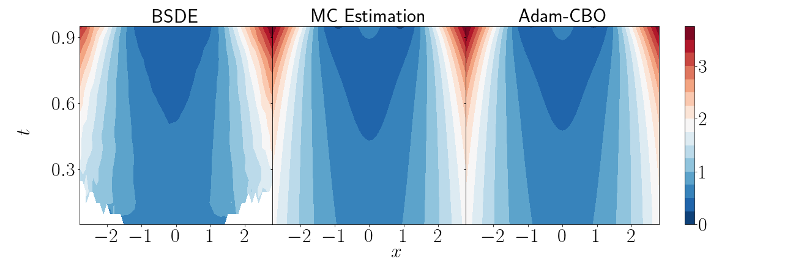

# Consensus based Optimal Control
Welcome to the repository for the **Consensus-Based Optimization (CBO) method** for solving **Stochastic Optimal Control (SOC)** problems. This repository contains code that implements the CBO method for different cases of stochastic control problems. The key feature of this method is to address high-dimensional problems effectively without relying on gradients, offering a scalable solution for complex control tasks.

## Overview
This repository presents the CBO method applied to three different cases of stochastic optimal control problems:

* Linear-Quadratic-Gaussian (LQG) Control Problem: Solving classic LQG problems using our proposed consensus-based approach.

* Ginzburg-Landau Model: Controlling superconductors under an external electromagnetic field.

* Systemic Risk Mean-Field Control Problem: Addressing systemic risk in environments with multiple indistinguishable agents (e.g., financial markets).

The main methods implemented are:

* M-CBO: A momentum-based consensus optimization method.

* Adam-CBO: An adaptive extension of M-CBO that introduces faster convergence through adaptive momentum.

* Backward Stochastic Differential Equation [[1]](#han2018)

The code is organized into different folders corresponding to each case, with result plots and analysis available for each.

## Installation
```
conda create -n cbo
conda activate cbo
conda install jax=0.4.23 chex=0.1.86 
```

## Folder Structure

The repository is organized as follows:

* **LQ/**: Contains code for the LQG control problem.

* **Ginzburg_landau/**: Code and data for the Ginzburg-Landau model.

* **mean_field/**: Implementations for mean-field systemic risk control.

* **result/**: Scripts for generating and saving plots for analysis and comparison.


## Result
The figure shows the value function $u(t,x)$ in one-dimensional case  computed by BSDE method, MC Estimation(*reference*), and Adam-CBO (*our method*) with terminal cost $ g(\mathbf x) = \ln \frac{1 + (\| \mathbf  x \|^2 - 1)^2}{2} $. 


## References
<a id="han2018">[1]</a> 
J. Han, A. Jentzen, W. E, Solving high-dimensional partial differential equations using deep learning, Proc. Natl. Acad. Sci. U.S.A.
115 (34) 8505-8510,
https://doi.org/10.1073/pnas.1718942115 (2018).